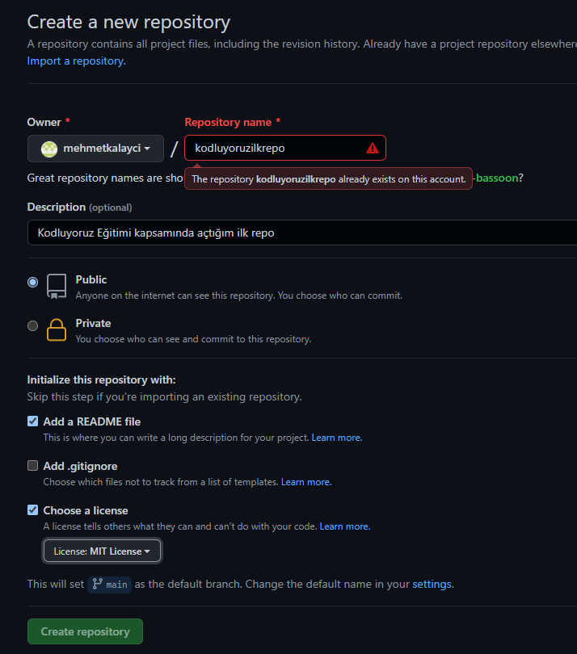

# Kodluyoruz Ilk Repo

Bu repo [Kodluyoruz](https://kodluyoruz.com) Front-End Eğitiminde oluşturuğumuz ilk repo. İçerisinde bir adet README dosyası, bir adet de index.html barındırıyor.



# Installation

Öncelikle projeyi clone layın!
```
git clone https://github.com/mehmetkalayci/kodluyoruzilkrepo.git
```

# Usage

Projeyi cloneladıktan sonra Visual Studio Code programında açınız.

Linux için;

```bash
cd kodluyoruzilkrepo
code .
```

#Contributing
Pull requestler kabul edilir. Büyük değişikler için, lütfen önce neyi değiştirmek istediğiniz tartışmak için bir konu açınız.

# License
[MIT](https://github.com/mehmetkalayci/kodluyoruzilkrepo/blob/main/LICENSE)